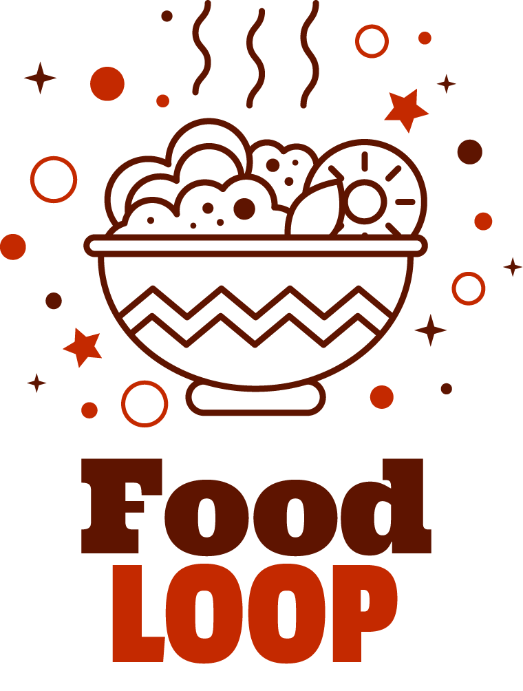

 # FoodLOOP - Food Language Object Oriented Programming

Elaborado por:
- Victor Hugo Elizalde Muñoz
- Oscar Michel Herrera

## foodLOOP

Es un lenguaje orientado a objetos que utiliza términos culinarios para programar, haciendo más fácil para la gente empezar a aprender fundamentos de programación.

### Tipos de Datos

Tipo	foodLOOP
Integer	nocortable
Float	cortable
String	nombre
Booleano	estado

Operadores

|Operador|Tipo|
|--------|----|
|+|Aritmético|
|-|Aritmético|
|*|Aritmético|
|/|Aritmético|
|<|Lógico|
|>|Lógico|
|<=|Lógico|
|>=|Lógico|
|<>|Lógico|
|==|Lógico|
|&&|Lógico|
||||Lógico|


### Caracteres Especiales

|Carácter|Uso|
|--------|---|
|=|Asignación|
|;|Final de línea|
|.|llamada de método de objeto|


### Declaración de Variables

Todas las variables son ingredientes.

Ejemplo:
```
Ingrediente a : nocortable; <------ Varible vacia
Ingrediente a : nocortable = 5; <------ Varible con valor
Ingrediente a : nocortable[5]; <------ Arreglo
Ingrediente a : nocortable[5,5]; <------ Matriz
```

Asignar valores a arreglos o matrices

Ejemplo:
```
A[0] = 2;
A[0,0] = 4;
```
Declaración de funciones

Se define el tipo de retorno luego el nombre de variable, los parametros y servir es el return.

Ejemplo:
```
receta nocortable suma(nocortable a, nocortable b)
	servir a+b;
terminar receta
```
Llamada de funciones

Ejemplo:
```
a = suma(5,5);
```

if and else

Ejemplo:
```
si(1 < 0) :
	a = 1;
sino :
	A = 0;
terminar si
```

While

Ejemplo:
```
mientras (1<0):
	A = a + 1;
terminar mientras
```

Lectura

Ejemplo:
```
a = traer();
```

Escritura

Ejemplo:
```
mostrar(a); ←-- valor de variable
mostrar(“a”); ←-- String
```
Clases

Ejemplo:
```
platillo Pechuga_Pollo:
    ingrediente sal : nombre;
    
    receta nombre getSal()
        servir sal;
    terminar receta
terminar platillo
```

Herencia
Ejemplo:
```
platillo Pechuga_Pollo:
    ingrediente sal : nombre = “sal de mar”;
    
    receta nombre getSal()
        servir sal;
    terminar receta
terminar platillo

platillo Cordon_Bleu << Pechuga_Pollo:
    ingrediente sal : nombre;
    
    receta nombre getSal()
        servir sal;
    terminar receta
terminar platillo
```

Declarar Objetos
Ejemplo:
```
ingrediente restaurante1 : Pechuga_Pollo;
```

Llamada a métodos de objetos
Ejemplo:
```
restaurante1.getSal();
```

Extensión de programas
La extensión de los programas es .fl para que los reconozca el compilador

Estructura del programa
Primero se ponen las clases, luego las funciones y después el programa, todos son opcionales de poner menos el programa.

Instalación
Bajar el ambiente y correr todos los programas con ruby test.rb nombredemiprograma.fl
